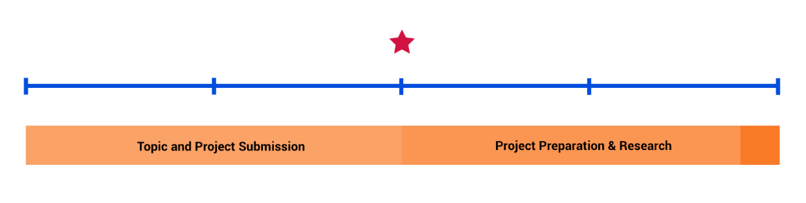
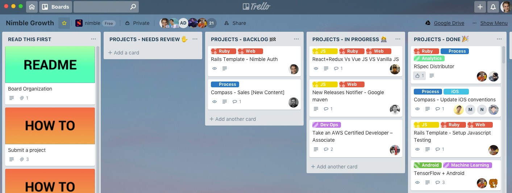

# Nimbl3 Growth

Investment time/hacking sessions held every month at Nimbl3.

## Introduction

Started in November 2016, Nimbl3 Growth is an event held every month allowing our team to:

* Research new technologies or even new stacks
* Improve our internal processes e.g. automating manual processes, decrease the time to start building a new application, 
speeding up our CI/CD pipelines.
* Work on non-client projects
* Have fun!

Each session lasts 1.5 days starting from Thursday mid-day until the following Friday (whole day). Our previous effort, 
called Tech Wednesdays, had a shorter duration of 0.5 day which was too short. Strong of this experience we decided to 
provide a larger block of time to achieve greater things.

This event is for all teammates to join: devs, PMs and designers!

At the end of the session, we gather for a show and tell time! Each team or individual prepared a presentation to share 
their achievements, struggles and what they have learnt. The repository contains all presentations for all sessions.

## How we do it

* Each project is validated two weeks before the session actually starts. This allows to perform research on topics 
and feasibility.  
* Once approved, each team/individual has an additional two weeks to prepare for the session. Additional research and 
planning are encouraged so that individual can hit the ground running as soon as the session starts.
* Once a session has started, all code is pushed to public repositories on Github. At the end of the first half day, teams 
are encouraged to start working on their presentation to save precious time on the second day. 
* The session wraps on Friday at 5 pm at which point we all gather to see the presentations of our teammates. Each project 
has a seven-minute presentation time.

We use a Trello board to manage topics and projects. The board is not only a repository of ideas for future topics or 
projects, but also where we manage the status of projects e.g. Approved, Backlog (ready to go), In Progress, Done.

## License

This project is Copyright (c) 2014-2018 Nimbl3 Ltd. It is free software,
and may be redistributed under the terms specified in the [LICENSE] file.

[LICENSE]: /LICENSE

## About

This project is maintained and funded by Nimbl3 Ltd.

We love open source and do our part in sharing our work with the community!
See [our other projects][community] or [hire our team][hire] to help build your product.

[community]: https://github.com/nimbl3
[hire]: https://nimbl3.com/
