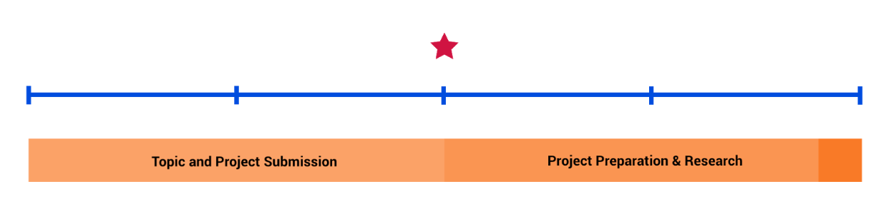
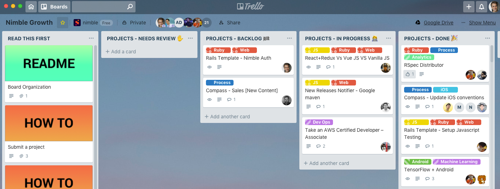

  

    <strong>Nimble Growth</strong>

---

Investment time/hacking sessions held every month at [Nimble](https://nimblehq.co) 🙌

## Introduction

Started in November 2016, Nimble Growth is an event held every two months allowing our team to:

- Share their knowledge.
- Improve our internal processes and platforms e.g. automating manual processes, decrease the time to start building a new application, speeding up our CI/CD pipelines.
- Sharpen communication and presentation skills.
- Work on non-client projects.
- Have fun! 🕺 💃

Each session is spread over six weeks (3 x two-week sprints) following by a two-week break to cool off but also to think about ideas for the next session. During the period of six weeks, the team can dedicate 0.5 day/two-week sprint thus totalling 1.5 days (3 x 0.5 day).

This event is for all teammates to join: devs, PMs and designers! Previously, when the team was smaller, individual could do a project on their own. With a larger team across multiple cities, project must be done in a squad of 3-5 members.

On the last Friday of the session, we gather for a show-and-tell time! Each team prepares a presentation to share their achievements, struggles and what they have learnt. The repository contains all presentations for all sessions.

## How we do it

* Each project is validated **two weeks before** the session actually starts. This allows to perform research on topics and feasibility. Research and planning are encouraged so that everyone can hit the ground running as soon as the session starts 🏃‍.
* Once approved, each squad has **six weeks to work**on the project.
* Once a session has started, all code is pushed to public repositories on Github. 
* At the end of the first half day, teams are encouraged to start working on their presentation to save precious time on the remaining half days. 
* The session wraps on Friday at 5 pm in the last two-week sprint at which point we all gather to see the presentations of our teammates. 
* Each project has a ten-minute presentation time.

* We use a Notion board to manage topics and projects. 
* The board is not only a repository of ideas for future topics or projects, but also where we manage the status of projects 
e.g. Approved, Backlog (ready to go), In Progress, Done.

## License

This project is Copyright (c) 2014 and onwards Nimble. It is free software, and may be redistributed under the terms specified in the [LICENSE] file.

[LICENSE]: /LICENSE

## About

This project is maintained and funded by Nimble.

We love open source and do our part in sharing our work with the community!
See [our other projects][community] or [hire our team][hire] to help build your product.

[community]: https://github.com/nimblehq
[hire]: https://nimblehq.co/
